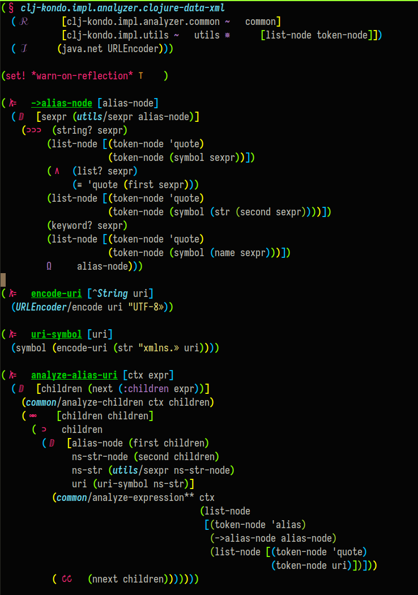

# Symbolic Clojure

An Emacs minor mode to make your Clojure code a little more fun.

You will probably hate this. Though a rare few may find joy.

Another great thing about this is that it avoids the need for a fancy
ligatured programming font, in case you're not using one.

NOTE: Still very much a WIP.



<sub>_**Caption:** Several vars, macros, and functions shown in red as symbols._</sub>

## Installation

Put this in your `vendor` dir or wherever and `reqire` it.

``` elisp
(add-to-list 'load-path "path to your clone of this")
(require 'symbolic-clojure)
```

## Usage (getting used to it)

This seems weird for just a little while. I wanted to try it and see
what the adjustment would be like. I've found that it actually makes
the code much more readable after you know the symbols, which I think
is really quick (though they are my own quirky conventions).

There is now a clean separation from clojure's own built-ins and the
functions and vars that we create. The eye now focuses solely on the
creation, and it not distracted by a bunch of other "words". Crazy,
but give it some consideration.

## I've got some explaning to do

The symbol representations were chosen slightly arbitrarily based on:

- mathematics conventions
- prior art
- APL
- some questionable creativity

### Symbols

- `λ` :: traditional for functions; taken further for ``defn` and `#(`

- `ⅅ` :: "domain", as in `let` is creating a scope/domain; all the
  `let` variants are combined with `ⅅ`

- `»` :: for end-quote makes quotes finally into a true pair; I tried `„`
  but they felt too much like commas. Would have made the opening
  quote a guillemet too, but couldn't get Emacs' cross-play with the
  highlighter to work

- `⊨` :: is `do` because it looks like a sequence of things

- `∀` :: this seems obviously fitting for "for(all)", but also
  combined it to make `doseq` feel very similar

- `⊃`, `⊃⊃`, `⊃⊃⊃` :: for `when` and `if` and `cond`; some of my
  favorites, clearly indicating that `when` is a single branch, and
  `if` is two, and `cond` is many.

- `§` :: another fave, for `ns`; just looks right!

- `∞∞` and `↻` :: `loop` and `recur`, since loop puts you into
  recursion with `recur` bringing you back to the top. Considered some
  musical "segno" symbols, but this felt better

- `∘` :: `comp`, traditional

- `◫` :: for `juxt`, looks like two boxes juxtaposed next to each
  other

- `ℛ` and `ℐ` :: `:require` and `:import`, just to be fancy

That's it for now, but hopefully more will come to light; feel free to
suggest more ideas!

### Weird spacing

Formatters/checkers such as cljfmt and zprint expect your code to be
indented properly. If you take the simple/naive approach to symbolic
replacement, letting say a single-char symbol replace a two-char
representation,  Emacs (and maybe other integrated formatters) will
indent with the assumption that your code is just a single char. E.g.,

``` clojure
(let [foo 1
      bar 2])
```

when replaced by a single character `ⅅ`, will indent the second line
insufficiently:

``` clojure
(ⅅ [foo 1
    bar 2])
```

So the trick this minor-mode accomplishes is to render it (arguably
less beautifully) as:

``` clojure
( ⅅ  [foo 1
      bar 2])
```

## Hunting for more symbols

- https://en.wikipedia.org/wiki/List_of_Unicode_characters
