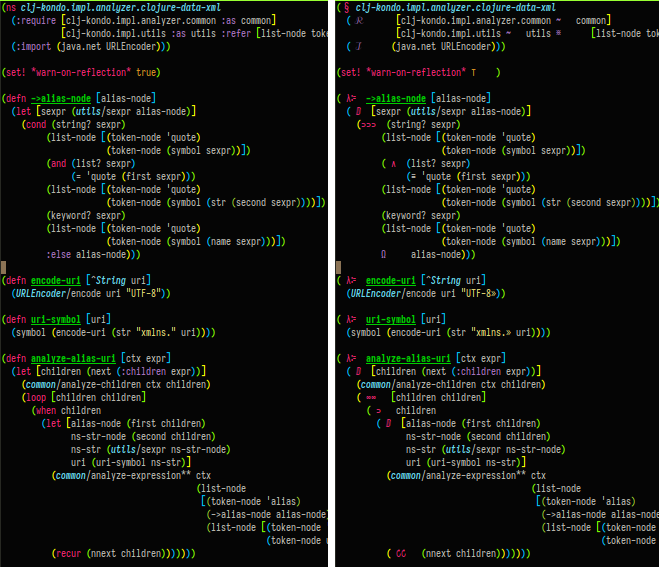

# Symbolic Clojure

An Emacs minor mode to make your Clojure code a little more fun, maybe
more readable, and impossible to pair on.

You might
[hate](https://practicaltypography.com/ligatures-in-programming-fonts-hell-no.html)
this. Though a rare few may find joy. And doing it this way without
ligatures shouldn't cause errors (see below).

Inspired by [Malabarba's ground breaking
post](https://endlessparentheses.com/using-prettify-symbols-in-clojure-and-elisp-without-breaking-indentation.html)
which also explains how to do the "interesting" spacing required.

The best way to try this is to just install it and open a bunch of
your `.clj` files in your Emacs with your own colors and fonts and
sizes and see what you think. There are many more symbolics than can
be shown here. Ideally, there would be hundreds, but it's challenging
to make them all obvious, so there are presently ~70.

NOTE: This is still a WIP.



<sub>_**Caption:** Side-by-side before/after of several vars, macros,
and functions shown in red and purple as special combo glyphs._</sub>

## Installation

Put this in your `vendor` dir (as symlink to your clone maybe) or
wherever and `require` it.

``` elisp
(add-to-list 'load-path "path to your clone of this")
(require 'symbolic-clojure)
```

## Usage (getting used to it)

This seems weird for just a little while. I wanted to try it and see
what the adjustment would be like. I've found that it actually makes
the code much more readable after you know the very repetitive symbols,
which I think is really quick (though they are my own quirky
conventions).

There is now a clean separation from clojure's own built-in character
words and the vars that we create. The eye can now focuses solely on the
creation, and it not distracted by a bunch of other "words". Crazy,
but give it some thought.

## I've got some explaining to do

The symbol representations were chosen slightly arbitrarily based on:

- mathematics conventions
- prior art
- APL
- some questionable creativity

### Symbols

- `λ` :: traditional for functions; taken further for `fn`, `defn`,
  and `#(`

- `ⅅ` :: "domain", as in `let` is creating a scope/domain; all the
  `*-let` variants are combined with `ⅅ`

- `»` :: for end-quote makes quotes finally into a true pair; I tried `„`
  but they felt too much like commas. Would have made the opening
  quote a guillemet too, but couldn't get Emacs' cross-play with the
  face treatment to work

- `⊨` :: is `do` because it looks like a sequence of things

- `∀` :: this seems obviously fitting for "for(all)", but also
  combined it to make `doseq` feel very similar

- `∧` and `∥` :: for `and` and `or`; chose `∥` instead of `∨` to make
  them stand apart better; still deciding

- `⊃`, `⊃⊃`, `⊃⊃⊃` :: for `when` and `if` and `cond`; some of my
  favorites, clearly indicating that `when` is a single branch, and
  `if` is two, and `cond` is many.

- `§` :: another fave, the "section marker", for `ns`; just feels
  right, like a chapter!

- `∞∞` and `↻↻` :: `loop` and `recur`, since loop puts you into
  recursion with `recur` bringing you back to the top. Considered some
  musical "segno" symbols, but this felt better; maybe should be three
  of them

- `∘` :: `comp`, traditional

- `◫` :: for `juxt`, looks like two boxes juxtaposed next to each
  other

- `ℛ` and `ℐ` :: `:require` and `:import`, just to be fancy

That's the most interesting for now (that aren't obvious), but
hopefully more will come to light; feel free to suggest more ideas!

### Weird spacing

Formatters/checkers such as cljfmt and zprint expect your code to be
indented properly. If you take the simple/naive approach to symbolic
replacement, letting say a single-char symbol replace a two-char
representation,  Emacs (and maybe other integrated formatters) will
indent with the assumption that your code is just a single char. E.g.,

``` clojure
(let [foo 1
      bar 2])
```

when replaced by a single character `ⅅ`, will indent the second line
insufficiently:

``` clojure
(ⅅ [foo 1
    bar 2])
```

That's what happens with vanilla `prettify-symbols-mode`, as shown
[here](http://xahlee.info/emacs/emacs/emacs_pretty_lambda.html). So
the trick this minor-mode accomplishes is to render it (arguably less
beautifully) as:

``` clojure
( ⅅ  [foo 1
      bar 2])
```

## Hunting for more symbols

- https://en.wikipedia.org/wiki/List_of_Unicode_characters
- https://en.wikipedia.org/wiki/APL_syntax_and_symbols
- https://en.wikipedia.org/wiki/Glossary_of_mathematical_symbols
